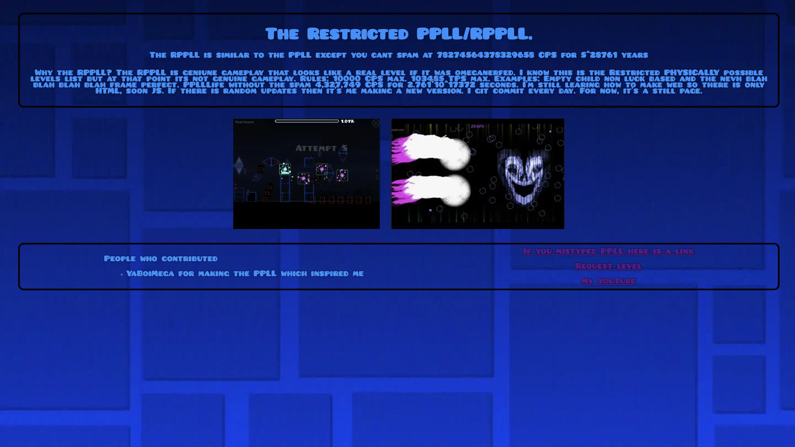

# RPPLL
The main README.md is in the webpage so go download it and test it. IDK how markdown works so this is just a regular txt and an image.  I am sorry for not commiting yesterday i just forgot and I'm learning JS so there will be nothing for a bit.